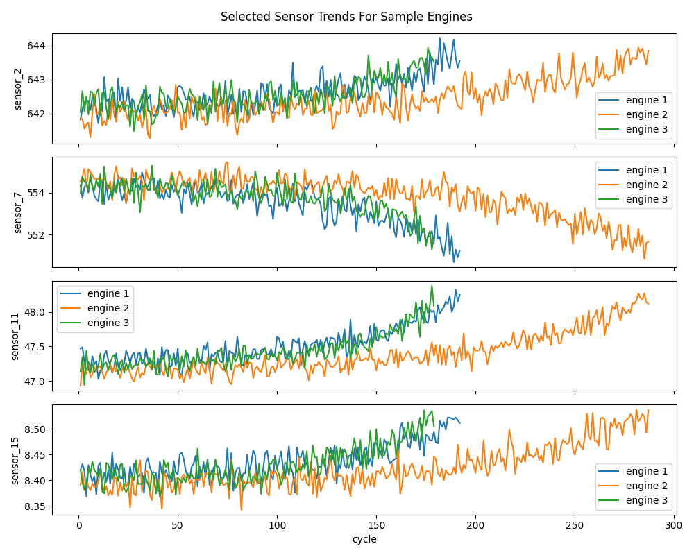
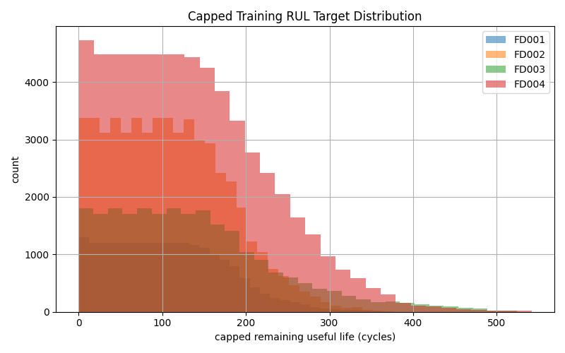

# NASA Turbofan Predictive Maintenance

This is a small predictive maintenance project using the NASA C-MAPSS turbofan engine degradation dataset.

I started with FD001 because it is the simplest subset: one operating condition and one fault mode. The goal is not to beat research papers, but to practice a realistic data workflow:

- load sensor data
- clean column names
- create a Remaining Useful Life target
- plot sensor degradation
- train a simple baseline model
- evaluate with MAE and RMSE

## Dataset

The data comes from NASA's C-MAPSS Jet Engine Simulated Data.

FD001 contains 100 training engine trajectories and 100 test trajectories. In the training data, each engine runs until failure. In the test data, each engine stops before failure, and NASA provides the true remaining useful life separately.

## Setup

```bash
python -m venv .venv
source .venv/bin/activate
pip install -r requirements.txt
```

## Run

Download and extract the FD001 files:

```bash
python src/load_data.py
```

Train the baseline model and create plots:

```bash
python src/baseline_model.py
```

The outputs are saved in `results/`.

## Results From My Run

The baseline model predicts RUL using the last available cycle for each test engine.

```text
MAE: 23.99 cycles
RMSE: 32.58 cycles
```

## Plots

Some sensor values change over the engine lifetime. I plotted a few sample engines to get a first look at the degradation patterns.



I also checked the distribution of the RUL target in the training data.



Finally, I compared the model predictions with the true RUL values for the test engines.


This is only a baseline. It is useful because it gives a starting point before trying more advanced feature engineering or sequence models.

## Files

```text
src/
├── load_data.py       # download and read FD001 files
├── preprocessing.py   # column names and RUL target
└── baseline_model.py  # plots, baseline model, metrics
```

## Notes

The next step would be to improve the model with better feature engineering, rolling-window features, or trying the harder FD002/FD003/FD004 subsets later.
