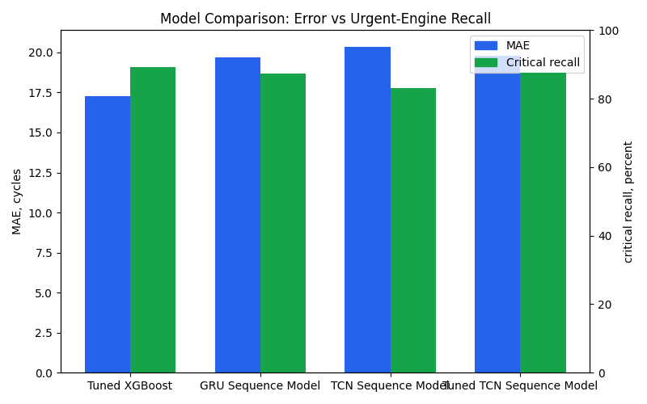
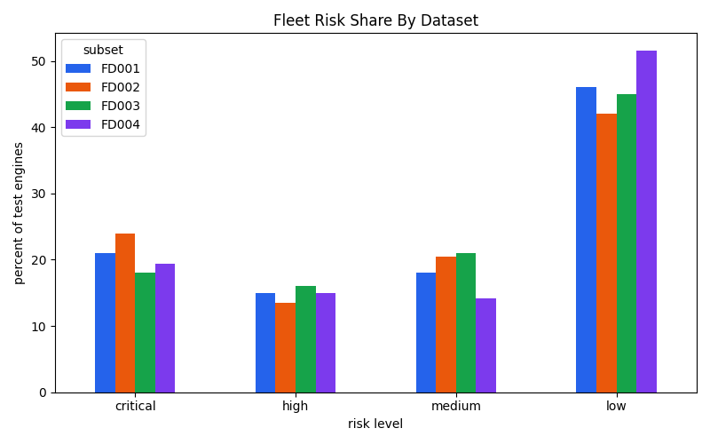
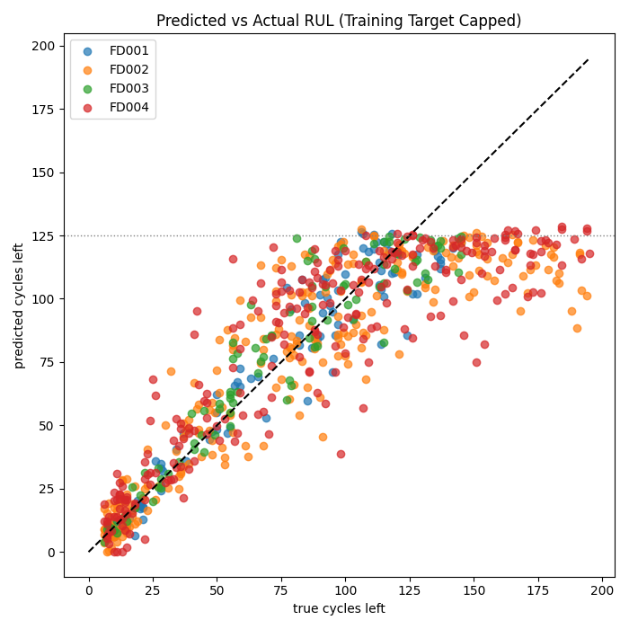
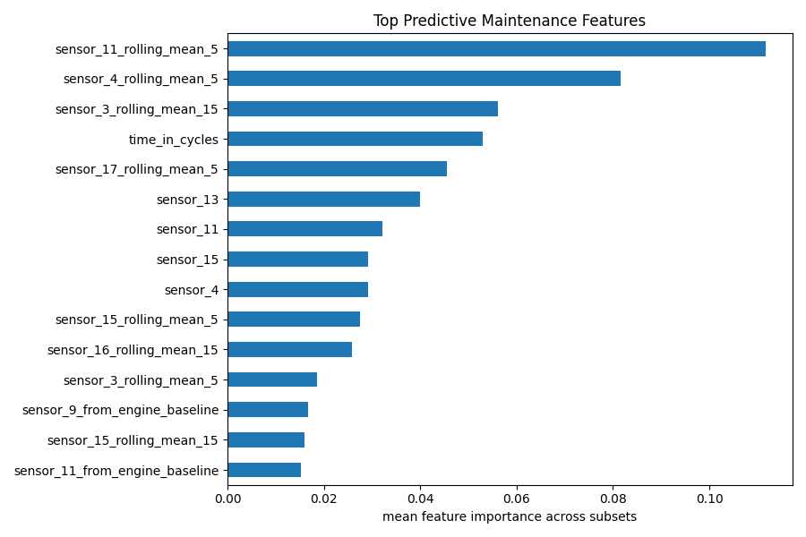

# NASA Turbofan Predictive Maintenance

This project uses the NASA C-MAPSS turbofan engine degradation dataset to build a predictive maintenance workflow.

The project predicts Remaining Useful Life, usually shortened to RUL, then converts that prediction into fleet risk levels and recommended maintenance actions.

## Dataset

The data comes from NASA's C-MAPSS Jet Engine Simulated Data.

This project uses all four C-MAPSS subsets:

- `FD001`: one operating condition and one fault mode
- `FD002`: six operating conditions and one fault mode
- `FD003`: one operating condition and two fault modes
- `FD004`: six operating conditions and two fault modes

FD002 is harder because changing operating conditions affect the sensor readings. FD003 is harder because it includes two fault modes. FD004 combines both difficulties. The dashboard keeps each subset's metrics separate.

## What The Pipeline Does

- loads FD001, FD002, FD003, and FD004 train, test, and true RUL files
- creates the RUL target for training engines
- builds predictive features from sensor readings
- includes engine age through `time_in_cycles`
- adds rolling sensor means, rolling sensor standard deviations, and cycle-to-cycle sensor deltas
- adds sensor slopes and deviation from each engine's own baseline
- tunes a separate XGBoost RUL model for each subset with engine-level validation snapshots
- predicts RUL for each test engine at its latest observed cycle
- assigns risk levels and maintenance actions
- tracks critical recall and false negatives so urgent engines are not hidden by average error
- writes a maintenance report
- creates charts and an interactive dashboard

## Setup

```bash
python -m venv .venv
source .venv/bin/activate
pip install -r requirements.txt
```

## Run

Download and extract the C-MAPSS files:

```bash
python src/load_data.py
```

Run the predictive maintenance pipeline:

```bash
python src/predictive_maintenance.py
```

Open the generated dashboard:

```bash
python3 -m http.server 8001
```

Then open:

```text
http://localhost:8001/results/dashboard.html
```

The dashboard is an HTML file, but the engine lookup loads `results/engine_timeseries.json`, so serving the project folder locally is more reliable than opening the file directly.

## Results

The model is tuned per subset because the four C-MAPSS subsets represent different operating and fault conditions. The tuner uses validation engines from the training data, creates several in-service snapshots per engine, then chooses the configuration that balances prediction error with the cost of missing truly critical engines.

Weighted overall results across all 707 test engines:

- MAE: `17.27` cycles
- RMSE: `23.94` cycles
- Risk bucket match: `77.1%`
- Critical recall: `89.2%`
- Critical false negatives: `17` engines

The `77.1%` risk bucket match is a strict four-level comparison between predicted and true risk bands. For a maintenance workflow, the more important safety metric is critical recall: how many engines with 30 cycles or fewer remaining were correctly flagged as critical. This run catches `89.2%` of truly critical engines.

## Visual Results

The dashboard and plots are generated into `results/` after running the pipeline.

### Model Comparison



### Fleet Risk Summary



### Prediction Quality



### Feature Importance



```text
RUL cap used for training: 125 cycles

FD001
Train engines: 100
Test engines: 100
MAE: 9.89 cycles
RMSE: 12.94 cycles
Risk bucket match: 79.0%
Critical recall: 84.0%
Critical false negatives: 4
Engines needing urgent maintenance: 21
Average predicted RUL: 74.60 cycles

FD002
Train engines: 260
Test engines: 259
MAE: 19.34 cycles
RMSE: 27.62 cycles
Risk bucket match: 78.8%
Critical recall: 96.7%
Critical false negatives: 2
Engines needing urgent maintenance: 62
Average predicted RUL: 72.95 cycles

FD003
Train engines: 100
Test engines: 100
MAE: 10.18 cycles
RMSE: 13.79 cycles
Risk bucket match: 81.0%
Critical recall: 90.0%
Critical false negatives: 2
Engines needing urgent maintenance: 18
Average predicted RUL: 76.28 cycles

FD004
Train engines: 249
Test engines: 248
MAE: 20.95 cycles
RMSE: 28.62 cycles
Risk bucket match: 73.0%
Critical recall: 83.0%
Critical false negatives: 9
Engines needing urgent maintenance: 48
Average predicted RUL: 78.90 cycles
```

## Dashboard And Outputs

The pipeline writes these main outputs to `results/`:

- `dashboard.html`: static fleet dashboard
- `engine_timeseries.json`: sensor history used by the dashboard engine lookup
- `maintenance_report.csv`: per-engine prediction, risk level, and action
- `subset_metrics.csv`: FD001, FD002, FD003, and FD004 model performance summary
- `model_tuning_results.csv`: validation results for the candidate model configurations
- `model_comparison.csv`: XGBoost versus GRU and TCN sequence models
- `tcn_tuning_results.csv`: validation grid for the TCN hyperparameter tuning experiment
- `tcn_tuned_test_metrics.csv`: held-out test results for the selected tuned TCN configs
- `model_metrics.txt`: model error and urgent-maintenance count
- `predicted_vs_actual.csv`: actual and predicted RUL values
- `predicted_vs_actual.png`: model accuracy plot
- `feature_importance.png`: strongest model features
- `fleet_risk_summary.png`: count of engines by risk level
- `model_comparison.png`: model comparison chart
- `prediction_error_by_dataset.png`: model error spread by dataset
- `rul_distribution.png`: capped training target distribution for technical review

## Model Comparison

Because turbofan degradation is time-dependent, I compared the selected tuned XGBoost model with real GRU and TCN sequence models built in PyTorch.

The models answer the same question: given the latest available information for a test engine, how many cycles are left before failure?

- **Tuned XGBoost** uses the latest engine snapshot plus engineered time features such as rolling sensor means, rolling standard deviations, deltas, slopes, and deviation from each engine's baseline.
- **GRU Sequence Model** reads the last 30 cycles directly as a sequence. GRUs are recurrent neural networks designed for ordered data.
- **TCN Sequence Model** also reads the last 30 cycles directly, but uses dilated 1D convolutions instead of recurrence. TCNs can learn local and medium-range temporal patterns efficiently.

The sequence models are trained with sliding windows every 10 cycles after the first 30 cycles, plus each engine's final cycle. That creates `14,937` sequence training windows across FD001-FD004 instead of only a few snapshots per engine.

Weighted overall comparison:

| Model | MAE | RMSE | Risk bucket match | Critical recall | Critical misses |
| --- | ---: | ---: | ---: | ---: | ---: |
| Tuned XGBoost | 17.27 | 23.94 | 77.1% | 89.2% | 17 |
| GRU Sequence Model | 19.71 | 27.49 | 73.3% | 87.2% | 20 |
| TCN Sequence Model | 20.37 | 27.65 | 72.1% | 83.1% | 27 |
| Tuned TCN Sequence Model | 19.81 | 27.66 | 74.8% | 87.6% | 20 |

### How To Read The Metrics

- **MAE**: average prediction error in cycles. Lower is better.
- **RMSE**: like MAE, but punishes large mistakes more. Lower is better.
- **Risk bucket match**: how often the predicted risk band matches the true risk band.
- **Critical recall**: how many truly urgent engines were correctly flagged as critical. This is the most important safety metric.
- **Critical misses**: engines with 30 cycles or fewer remaining that were not predicted as critical. Lower is better.

### What The Comparison Shows

XGBoost is still the best model in this project. It has the lowest average error, the best risk bucket match, the highest critical recall, and the fewest missed critical engines.

The sliding-window upgrade makes the sequence models much stronger than the earlier small-snapshot version. GRU improves from `21.98` to `19.71` MAE and reduces critical misses from `26` to `20`. TCN improves its critical misses from `31` to `27`.

For this C-MAPSS setup, engineered tabular features plus tuned XGBoost are stronger than the current GRU and TCN implementations. XGBoost is very effective when the time-series behavior is summarized with rolling, slope, delta, and baseline-deviation features.

A validation-based TCN hyperparameter tuning experiment is included:

```bash
python src/tcn_tuning_experiment.py
```

The tuning script tries multiple TCN hidden sizes, dilation patterns, dropout levels, loss functions, learning rates, and critical-engine loss weights. It selects the best configuration per subset using validation engines from the training set, then evaluates the selected configurations once on the held-out NASA test engines.

Tuning helped the TCN substantially: critical recall improved from `83.1%` to `87.6%`, and critical misses dropped from `27` to `20`. It especially helped FD002 and FD004. Tuned TCN still does not beat tuned XGBoost overall, but it becomes competitive with the GRU on maintenance recall.

XGBoost already uses per-subset validation tuning in this project. More XGBoost tuning is possible with a larger random search or Optuna-style optimization, but the current XGBoost model is already the strongest tested model. For the current project, XGBoost remains the main predictive maintenance model.

## Maintenance Report

Each row in `results/maintenance_report.csv` represents one test engine at its latest available cycle. The `subset` and `engine_id` columns show whether the engine came from FD001, FD002, FD003, or FD004.

The report includes:

- actual RUL
- predicted RUL
- prediction error
- risk level
- recommended maintenance action

The action rules are intentionally simple and easy to explain:

- `0-30` predicted cycles: urgent maintenance
- `31-60` predicted cycles: schedule maintenance
- `61-90` predicted cycles: inspect soon
- `91+` predicted cycles: normal monitoring

## Files

```text
src/
├── load_data.py                 # download and read all C-MAPSS subset files
├── preprocessing.py             # RUL target, feature engineering, action labels
├── predictive_maintenance.py    # model, report, plots, dashboard
└── tcn_tuning_experiment.py     # validation-based TCN hyperparameter tuning experiment
```

## Next Steps

The next step would be to validate the risk thresholds with domain assumptions or add a time-series model.
